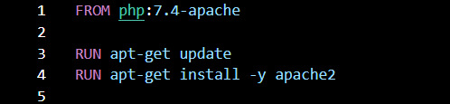
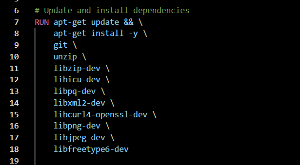
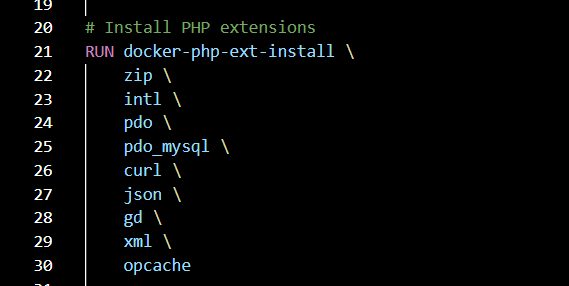
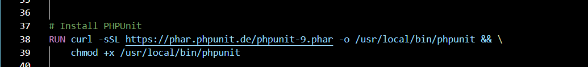
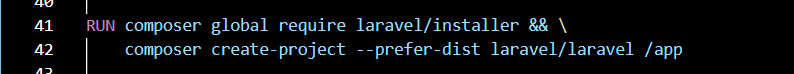
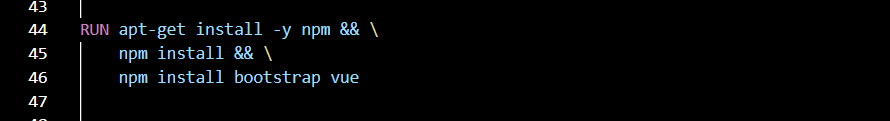
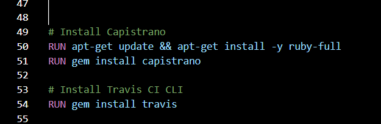
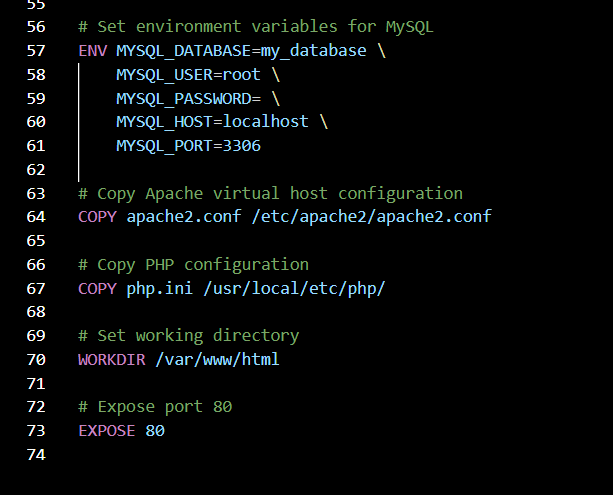

# devops-2022
# DevOps-2022-Project
config the docker image file to run the docker container.

## Overview
This project contains a docker image provides a complete development environment for building Laravel applications with a Bootstrap frontend, Vue.js components, and MySQL database. This Dockerfile is based on the PHP language.

## Tools of use for demonstration
- Docker Desktop
- Virtual Studio Code

## Packages installed.
- php
- Laravel
- Bootstrap
- Vue.js
- Mysql
- Git
- Apache 
- Composer
- etc.

##  Method to create dockerfile
*1. starts with the official php:7.4-apache image as the base image/*

  

*2. Installs the necessary dependencies and extensions for Laravel, Bootstrap, Vue.js, PHPUnit, and Capistrano. It also installs Git and sets up a MySQL server. using apt-get*

  

the command -y is mean that whenever the installation asks yes or no it will always answer yes

Git is a version control system, and to check the version or is it installed type this via Jupyter Nootbook
'!git --version'

*3.Install PHP extensions*

  

for sets up a MySQL server

*4. installs phpunit*

  

*5.installs Laravel using Composer.It creates a new Laravel project*

  

Laravel is a PHP web application framework that has a lot of dependencies, including several PHP extensions and libraries.
Installing Laravel using Composer in Docker provides a reliable and easy way to set up a development environment and deploy your application to production.

*6. install node.js and npm*

  

install choice packages "Node.js, npm" for Vue.js.

*7. installs Capistrano and Travis CI*

  

*8. Finally, set environment for mysql , configures Apache and php and sets the default command to start Apache.*

  

*9. Build image*

  

*10. Run docker container*

  

##  Method to demonstrate

*1. docker pull image*

  

*2. docker run*

  

Now open 'http://localhost:???'

## ERROR

  

